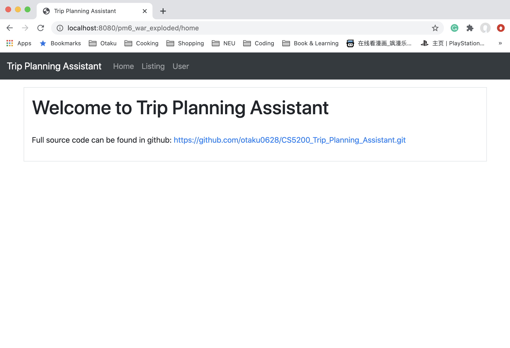
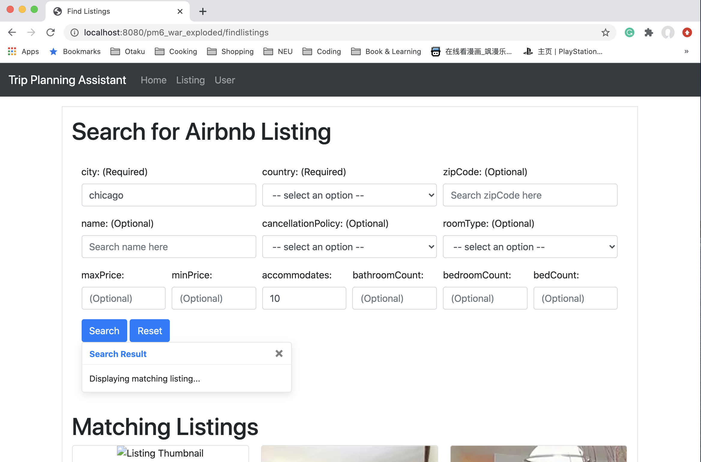
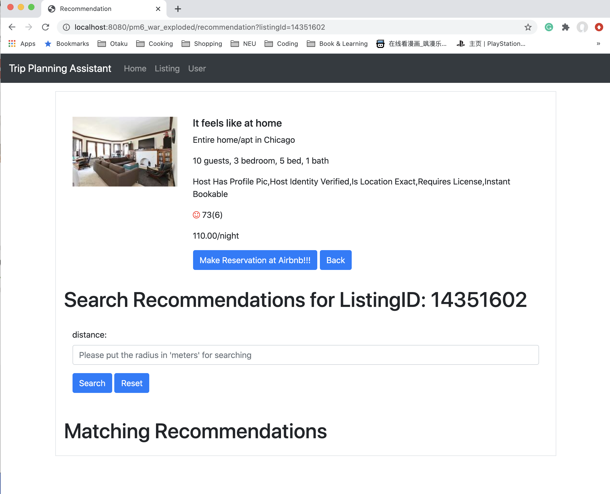
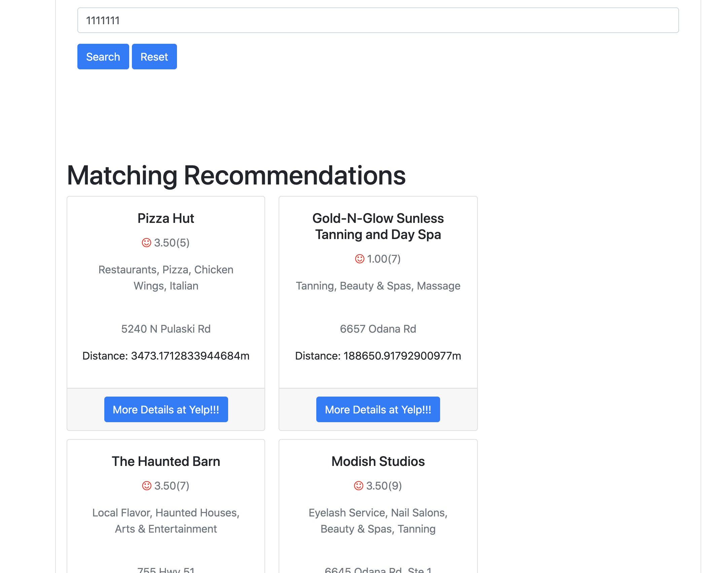

# Data Parser For CS5200 DBMS

## Summary

This repo is the final project for CS5200 DBMS

## DataSource

YelpDataSet (Json Format): https://www.yelp.com/dataset
AirbnbListing (CSV Format): https://public.opendatasoft.com/explore/dataset/airbnb-listings

DataParser: https://github.com/otaku0628/CS5200DataParser.git

## What It Does

- Trip Planning Helper Is A recommendation tool That Provides:
  1. Airbnb/Hotel listing for client’s target city
  2. Restaurant recommendations nearby selected Airbnb/Hotel
  3. Entertainment recommendations nearby selected Airbnb/Hotel
- Target user: people who are struggling to find place to eat and have fun when booking the
 Airbnb/Hotel for their trip.

## Result

## TODO

- Add pagination support when fetching data for better performance

